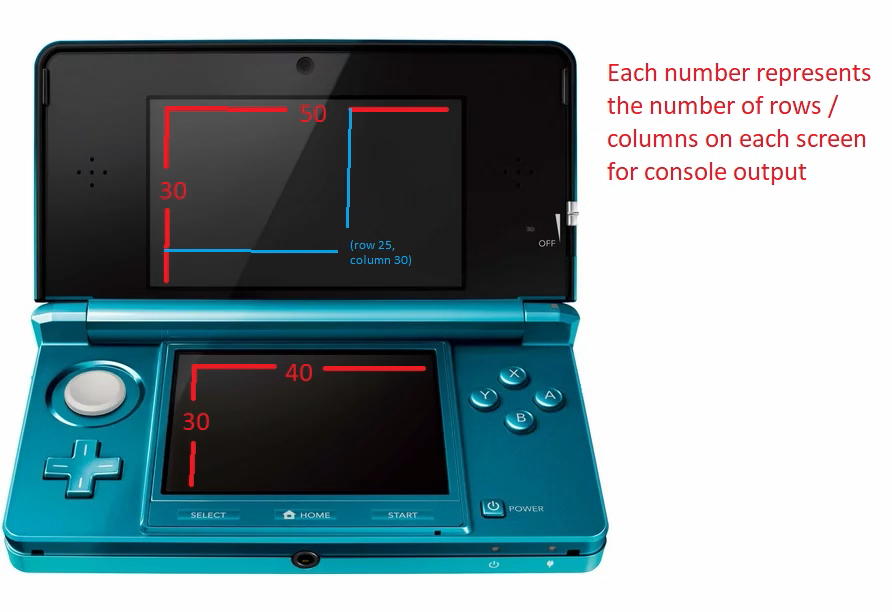

# 3dscolor
A simple C++ library to assist in adding color and moving lines to specific places for Nintendo 3DS homebrew console projects.

## Usage
### Rows and colums


The top screen has 30 rows and 50 columns. The bottom screen has 30 rows and 40 columns.

### Foreground and Background
There are eight different colors avaliable.
- black
- red
- green
- yellow
- blue
- magenta
- cyan
- white

There are also two different modes
- Foreground
- Background

Setting the color is easy.
```
#include "color.h" // include the header file

// Setup components of the script.
Foreground FORE;
Background BACK;

std::cout << BACK.red << "The background is red." << std::endl;

std::cout << FORE.yellow << "The text color is yellow." << std::endl;
```

### Reset
You may want to reset to no colors in the foreground and background.
```
Reset RESET;

std::cout << "This text is " << FORE.yellow << "yellow. " << RESET.reset << "Goodbye!" << std::endl;
//            ^ No style                        ^ Yellow                     ^ Style has been reset
```

### Move
You might want to move the text to a specific line
```
Move MOVE;

std::cout << FORE.blue << MOVE.goTo(30, 0) << "This line is on row 30 and column 0";
//           ^ Blue       ^ Move to row 30 and column 0
```

## Demo
There is a demo included. Run the `make` command to build it, then open the homebrew launcher, press `y` and then run the command `$DEVKITPRO/tools/bin/3dslink color.3dsx -a ip.address.on.3ds.screen`
Alternatively, download the `color.3dsx` file and put it into the `3ds` folder on your 3DS' SD Card, then run it via the homebrew launcher. 


Credit to [this overpriced restored 3DS on walmart](https://www.walmart.com/ip/Restored-Nintendo-3DS-Aqua-Blue-Handheld-Gaming-System-with-Stylus-SD-Card-Charger/430295685?wmlspartner=wlpa&selectedSellerId=539&adid=22222222227430295685_144893864830_18291203882&wl0=&wl1=g&wl2=c&wl3=620762789706&wl4=pla-1743906452838&wl5=1023631&wl6=&wl7=&wl8=&wl9=pla&wl10=111839965&wl11=online&wl12=430295685&veh=sem&gclid=Cj0KCQjw_r6hBhDdARIsAMIDhV_WTX3G--_58AuU51Bkff4EF6u0xLKDESdWFPXqeAAauclmtWvdj4AaAqV1EALw_wcB&gclsrc=aw.ds) for the image.
And thanks to [this article](https://guidedhacking.com/threads/intro-to-nintendo-3ds-scripting-outputs.20108/) for showing me that this was all possible.


